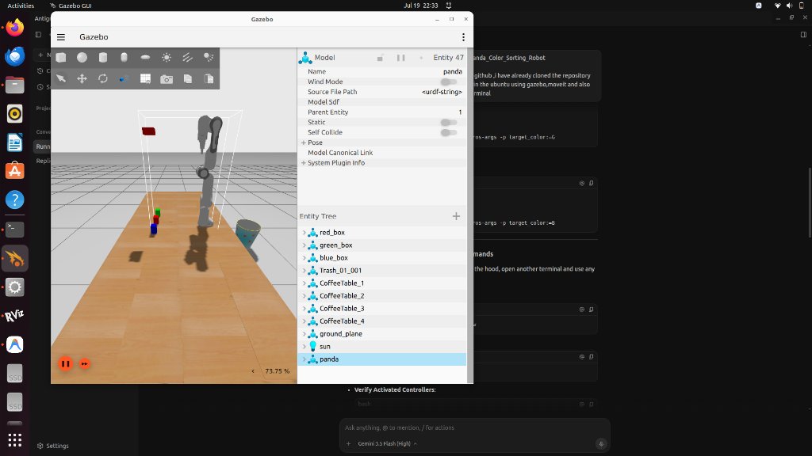

# ROS 2 Robotic Pick and Place System

This project is a beginner-friendly guide to making a simulated robotic arm automatically pick up colored boxes from a table and place them into a box. 

We use a simulated Franka Panda robot arm, a virtual camera to find the boxes, and a simple Python script to plan the paths and control the robot.

Here is what the simulation looks like:



---

## What is inside this project?

The project is split into simple folders (called packages) that handle different tasks:
- **`robot_picking_bringup`**: Contains the main command to start the entire simulation and load all nodes.
- **`robot_picking_controller`**: Controls the motors in the robot arm and hand (gripper).
- **`robot_picking_description`**: Contains the 3D models of the robot, tables, and colored boxes.
- **`robot_picking_moveit`**: Helps the robot plan safe, smooth movements so it doesn't crash into the table.
- **`robot_picking_vision`**: Reads the camera feed and uses OpenCV to find the coordinates (X, Y, Z position) of the colored boxes.
- **`pymoveit2`**: A helper library that lets you write simple Python commands to open/close the hand and move the arm.

---

## Prerequisites

To run this simulation, you need:
- **Ubuntu 22.04** installed on your system.
- **ROS 2 Humble** installed.
- **Gazebo Sim** (Ignition Fortress) and **MoveIt 2** installed.

---

## How to Install and Build

1. Open your terminal and create a workspace directory:
   ```bash
   mkdir -p ~/ros2_ws/src
   cd ~/ros2_ws/src
   ```

2. Clone this repository into your `src` folder:
   ```bash
   git clone https://github.com/hasmithatadavarthy/ros2_pick-and-place_robot.git
   ```

3. Go back to the main workspace folder and build the code:
   ```bash
   cd ~/ros2_ws
   colcon build
   ```

4. Tell your terminal where the built code is:
   ```bash
   source install/setup.bash
   ```

---

## How to Run the Project

Follow these steps to run the simulation:

### Step 1: Start the Simulation
Open a terminal and run the main launch command:
```bash
ros2 launch robot_picking_bringup pick_and_place.launch.py
```
*Wait a few seconds for the Gazebo simulator and the RViz visualizer to open. You will see the robot arm and the colored boxes sitting on the table.*

### Step 2: Start the Picking Script
Open a **new terminal tab**, source the code, and run the Python script to tell the robot which box to pick up:

- **To pick the Red box**:
  ```bash
  source ~/ros2_ws/install/setup.bash
  ros2 run pymoveit2 pick_and_place.py --ros-args -p target_color:=R
  ```

- **To pick the Green box**:
  ```bash
  source ~/ros2_ws/install/setup.bash
  ros2 run pymoveit2 pick_and_place.py --ros-args -p target_color:=G
  ```

- **To pick the Blue box**:
  ```bash
  source ~/ros2_ws/install/setup.bash
  ros2 run pymoveit2 pick_and_place.py --ros-args -p target_color:=B
  ```